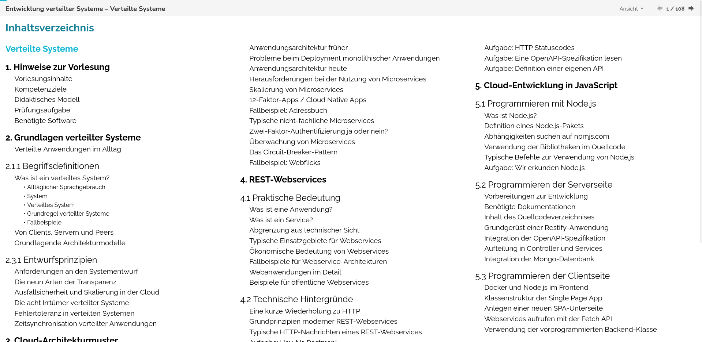
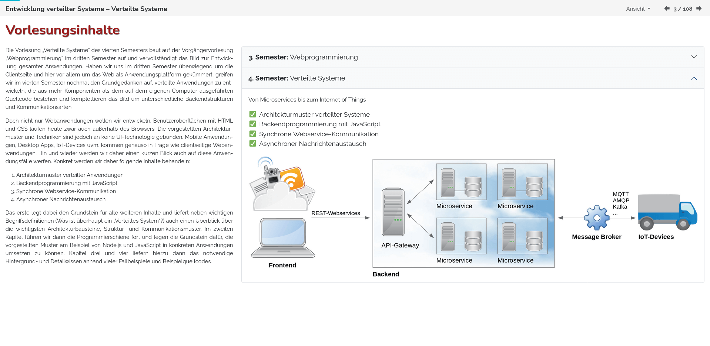

lecture-slides.js - JavaScript library for online learning materials
====================================================================

Getting Started
---------------

Using `lecture-slides.js` is easy. Simply download the [template presentation](https://www.github.com/DennisSchulmeister/ls-presentation-template)
and start editing the html file. For a more extensive demonstration of all features,
download the [demo presentations](https://www.github.com/DennisSchulmeister/ls-presentation-demos),
instead.

Screenshots
-----------

First things first. At least me, the first thing I'm looking for are screenshots.
So here you go.

Still here, I see? Great, now I can tell you what this is all about.

What is it?
-----------

This is a HTML presentation framework, which allows you to create HTML-based
online learning materials. In that regard it is very similar to reveal.js and
other HTML slideshow makers. But unlike them it is more tailored for e-learning
materials, and the different use cases for learners and teachers.

As a learner it is nice that each slide may also have detailed explanations
which are displayed together with the slides. So instead of just a few bullet
points or a just a few images the learner also gets a written script along
with it. And for the teacher or lecturer these detailed notes can be hidden
in order to throw the slides on the wall.

`lecture-slides.js` builds upon `bootstrap` and `jquery`. So the full power
of HTML and these libraries can be used in order to create visually rich and
stuning slides, much better than anything that PowerPoint, Keynote or Impress
can ever, too. And since this is HTML it is very easy to make the slides
responsive so that they can be consumed on any screen, from the smallest smart
phones up to the biggest TVs.

But if you don't want to, you don't have to go that far. If all you need are
a few simple slides, that's easy, too. And they even look good by default,
without all that fiddling around like with the WYSIWYG programs.

Other HTML5 presentation frameworks
-----------------------------------

Of course this is not the only HTML5 presentation framework. There are literally
dozens of them out there, each with their own strengths and weaknesses. If
`lecture-slides.js` is not for you, you might enjoy one of these:

  * [Shower](https://shwr.me/)
  * [reveal.js](http://lab.hakim.se/reveal-js/#/)
  * [deck.js](http://imakewebthings.com/deck.js/)
  * [impress.js](http://impress.github.io/impress.js/#/bored)
  * [bespoke.js](http://markdalgleish.com/projects/bespoke.js/)
  * [remark.js](https://remarkjs.com/)
  * [flowtime.js](https://github.com/marcolago/flowtime.js/)
  * [slidify](http://slidify.org/)
  * …
  * Gosh, are there many of these

Copyright
---------

lecture-slides.js (https://www.github.com/DennisSchulmeister/lecture-slides.js)  
© 2017  Dennis Schulmeister-Zimolong <dennis@pingu-mail.de>

This program is free software: you can redistribute it and/or modify
it under the terms of the GNU Affero General Public License as
published by the Free Software Foundation, either version 3 of the
License, or (at your option) any later version.
